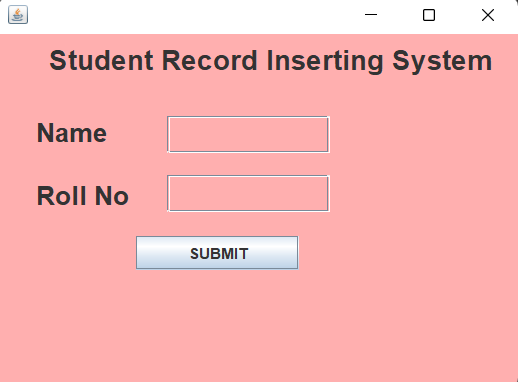

# Student Record Inserting System

## Overview

The **Student Record Inserting System** is a desktop application built using **Java Swing** for the GUI and **Hibernate ORM** for database management. The application allows users to input student details, such as their name and roll number, and store them in a PostgreSQL database.

## Features

- **User-Friendly GUI:** Developed using Java Swing, the application provides a simple interface for adding student records.
- **Database Integration:** Uses Hibernate ORM to interact with a PostgreSQL database for storing student data.
- **Real-Time Validation:** Ensures that no fields are left empty before submitting the form.
- **Feedback:** Provides user feedback on successful record insertion or if any error occurs during the process.

## Screenshots

Here is a screenshot of the Student Record Inserting System:



## Tech Stack

- **Frontend:** Java Swing (for GUI)
- **Backend:** Hibernate ORM
- **Database:** PostgreSQL
- **Build Tool:** Maven

## Setup and Installation

### Prerequisites
- Java 8 or higher
- PostgreSQL installed and configured
- Maven installed

### Steps to Run

1. Clone the repository:
    ```bash
    git clone https://github.com/Ritesh-Gawai/student-record-inserting-system.git
    ```
   
2. Set up PostgreSQL:
    - Create a PostgreSQL database:
      ```sql
      CREATE DATABASE student_db;
      ```
    - Update the database connection details in `hibernate.cfg.xml`.

3. Build and run the application using Maven:
    ```bash
    mvn clean install
    java -jar target/formgui-1.0.jar
    ```

## Configuration

In the `hibernate.cfg.xml` file, update the following properties to match your local PostgreSQL setup:

```xml
<property name="hibernate.connection.url">jdbc:postgresql://localhost:5432/your_database</property>
<property name="hibernate.connection.username">your_username</property>
<property name="hibernate.connection.password">your_password</property>
